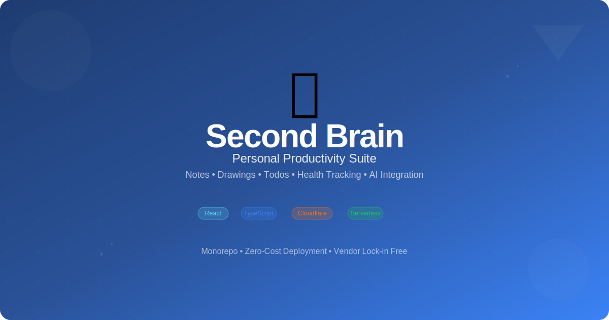

# Second Brain App



Personal productivity suite with notes, todos, drawings, and health tracking. Built with serverless-first architecture on Cloudflare Workers.

## Quick Start

```bash
# Clone and install
git clone <repo-url>
cd second-brain
pnpm install

# Development
pnpm dev          # Start all apps
pnpm dev:web      # Web app only (localhost:3000)
pnpm dev:api      # API only (localhost:8787)

# Build
pnpm build

# Deploy
pnpm deploy       # Deploy API to Cloudflare
```

## Architecture

**Monorepo Structure:**

- `apps/web` - React 19 frontend (Vite + TypeScript)
- `apps/api` - Cloudflare Workers API (Hono 4.0 + TypeScript)
- `apps/mcp-server` - AI integration server
- `packages/database` - Database utilities
- `packages/shared` - Shared types and utilities

**Tech Stack:**

- **Frontend**: React 19, Vite 6.1, TanStack Router 1.121, ShadCN/UI (New York), Tailwind CSS 4.0
- **Backend**: Cloudflare Workers, Hono 4.0, Zod validation
- **Database**: Cloudflare D1 (SQLite) with migrations
- **Cache**: Cloudflare KV
- **State Management**: Zustand 5.0, TanStack Query 5.81
- **Build**: Turborepo + pnpm workspaces

## Features

### Implemented

- ✅ **Authentication**: OAuth 2.1 with GitHub, JWT tokens, session management
- ✅ **Coupon Book**: Full CRUD, bulk import, expiration tracking, LINE Man integration
- ✅ **Drawings**: tldraw canvas for visual note-taking

### Planned

- 🚧 **Notes**: Rich text editor with markdown export
- 🚧 **Todos**: Eisenhower Matrix task management
- 🚧 **Health**: Meal logging and body composition tracking
- 🚧 **AI**: MCP server integration for intelligent assistance

## Development

**Prerequisites:**

- pnpm 9.15.0+
- Node.js 18+
- Cloudflare account (free tier)

**Environment Setup:**

```bash
# Install dependencies
pnpm install

# Login to Cloudflare
pnpm wrangler login

# Create D1 database
pnpm wrangler d1 create second-brain-db

# Create KV namespace
pnpm wrangler kv:namespace create "CACHE"

# Run migrations
pnpm --filter @second-brain/api migrate:local
```

**Database Commands:**

```bash
pnpm --filter @second-brain/api migrate:local   # Apply migrations locally
pnpm --filter @second-brain/api migrate:prod    # Apply migrations to production
pnpm --filter @second-brain/api migrate:list    # List migration status
pnpm --filter @second-brain/api migrate:create  # Create new migration
```

**Local Development:**

- Frontend: `http://localhost:3000` (Vite dev server)
- API: `http://localhost:8787` (Wrangler dev server)
- Production: `https://2b.thitiphon.me`
- Database: Local SQLite via Wrangler

## Deployment

**API Deployment:**

```bash
# Build and deploy to production
pnpm deploy

# Or manually
pnpm --filter @second-brain/api build
pnpm --filter @second-brain/api deploy
```

**Web Deployment:**

```bash
# Build web app
pnpm --filter @second-brain/web build

# Static files served via Cloudflare Workers Assets
```

## Security

- OAuth 2.1 authentication with GitHub
- JWT tokens with secure cookie storage
- CORS protection for multiple origins
- Zod validation for all API inputs
- Session management with Cloudflare KV

## UI Components

This project uses [shadcn/ui](https://ui.shadcn.com/) components (New York style). To add new components:

```bash
pnpm dlx shadcn@latest add button
```

## Testing

```bash
# Run all tests
pnpm test

# Run tests for specific app
pnpm --filter @second-brain/web test

# Type checking
pnpm --filter @second-brain/web type-check
```

## License

MIT
