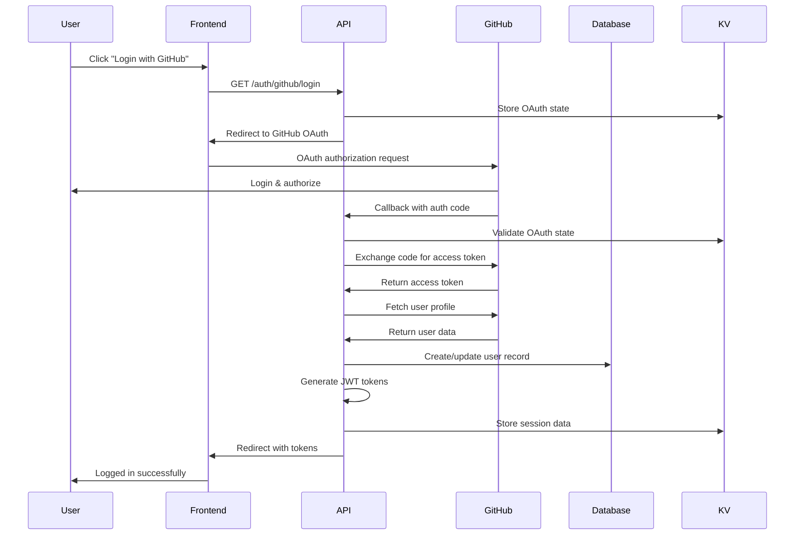

# Product Requirements Document: Authentication Flow

## Second Brain App

### Executive Summary

This PRD defines the authentication system for the Second Brain app, implementing OAuth 2.1 with GitHub as the initial provider while maintaining vendor-agnostic architecture for future provider additions.

### Business Context

**Strategic Alignment:**

- Maintains $0 deployment cost using free OAuth providers
- Supports "vendor-agnostic modularity" principle
- Enables secure user data isolation across all app features
- Foundation for MCP server OAuth 2.1 integration

**Success Criteria:**

- Secure user authentication with industry-standard protocols
- Seamless user experience across desktop/mobile
- Zero-cost implementation using free tier services
- Extensible architecture for multiple OAuth providers

---

## User Stories & Requirements

### Core User Stories

**US-1: User Registration**

```
As a new user
I want to sign up using my GitHub account
So that I can access my personal productivity tools securely
```

**US-2: User Login**

```
As a returning user
I want to log in with my GitHub account
So that I can access my existing notes, todos, and data
```

**US-3: Session Management**

```
As a logged-in user
I want my session to persist across browser tabs and reasonable time periods
So that I don't need to re-authenticate frequently
```

**US-4: Secure Logout**

```
As a security-conscious user
I want to log out and invalidate my session
So that my data remains secure on shared devices
```

### Functional Requirements

**FR-1: OAuth 2.1 Implementation**

- Support GitHub OAuth as primary provider
- Implement standard OAuth 2.1 authorization code flow
- Handle OAuth errors gracefully (denied access, invalid state)
- Validate OAuth state parameter to prevent CSRF attacks

**FR-2: User Profile Management**

- Store user profile data (ID, email, name, avatar)
- Link GitHub profile to internal user ID
- Handle profile updates from OAuth provider
- Support account linking if user changes GitHub email

**FR-3: Session & Token Management**

- Generate secure JWT tokens with appropriate expiration
- Implement token refresh mechanism
- Store minimal session data in Cloudflare KV
- Provide session validation middleware for API endpoints

**FR-4: Security Controls**

- Implement rate limiting on auth endpoints
- Validate all OAuth callback parameters
- Encrypt sensitive data at rest in database
- Apply security headers and CORS policies

**FR-5: Provider Abstraction**

- Design extensible OAuth provider interface
- Support easy addition of Google, Microsoft, etc.
- Maintain consistent user experience across providers

### Non-Functional Requirements

**NFR-1: Performance**

- OAuth flow completion within 3 seconds
- Token validation under 100ms
- Session lookup under 50ms

**NFR-2: Security**

- JWT tokens with 1-hour expiration
- Refresh tokens with 30-day expiration
- Rate limiting: 10 auth attempts per minute per IP
- HTTPS-only cookies with secure flags

**NFR-3: Reliability**

- 99.9% uptime for auth endpoints
- Graceful degradation if OAuth provider is down
- Automatic retry logic for transient failures

**NFR-4: Scalability**

- Support up to 10,000 concurrent users
- Horizontal scaling via Cloudflare Workers
- KV storage for session data distribution

---

## Technical Architecture

### System Components

**Frontend (React)**

- Login/logout UI components
- OAuth redirect handling
- Token storage and management
- Authentication state management (Zustand)

**API (Cloudflare Workers + Hono)**

- OAuth callback handlers
- JWT token generation and validation
- Session management endpoints
- Authentication middleware

**Database (Cloudflare D1)**

- User profiles and account linking
- OAuth provider associations
- Audit logs for authentication events

**Cache (Cloudflare KV)**

- Active session storage
- OAuth state validation
- Rate limiting counters

### Authentication Flow



### Database Schema

```sql
-- Users table
CREATE TABLE users (
    id TEXT PRIMARY KEY,
    github_id INTEGER UNIQUE NOT NULL,
    email TEXT NOT NULL,
    name TEXT NOT NULL,
    avatar_url TEXT,
    created_at DATETIME DEFAULT CURRENT_TIMESTAMP,
    updated_at DATETIME DEFAULT CURRENT_TIMESTAMP
);

-- OAuth providers table (for future multi-provider support)
CREATE TABLE oauth_providers (
    id TEXT PRIMARY KEY,
    user_id TEXT NOT NULL,
    provider TEXT NOT NULL,
    provider_user_id TEXT NOT NULL,
    provider_email TEXT NOT NULL,
    created_at DATETIME DEFAULT CURRENT_TIMESTAMP,
    FOREIGN KEY (user_id) REFERENCES users(id),
    UNIQUE(provider, provider_user_id)
);

-- Auth sessions table
CREATE TABLE auth_sessions (
    id TEXT PRIMARY KEY,
    user_id TEXT NOT NULL,
    token_hash TEXT NOT NULL,
    expires_at DATETIME NOT NULL,
    created_at DATETIME DEFAULT CURRENT_TIMESTAMP,
    last_accessed DATETIME DEFAULT CURRENT_TIMESTAMP,
    FOREIGN KEY (user_id) REFERENCES users(id)
);
```

### API Endpoints

**Authentication Endpoints**

```typescript
// OAuth initiation
GET /auth/:provider/login
// - Generates OAuth state
// - Redirects to provider authorization URL

// OAuth callback
GET /auth/:provider/callback
// - Validates state parameter
// - Exchanges auth code for access token
// - Creates/updates user record
// - Generates JWT tokens
// - Redirects to frontend with tokens

// Token refresh
POST /auth/refresh
// - Validates refresh token
// - Generates new access token
// - Updates session record

// Logout
POST /auth/logout
// - Invalidates session
// - Clears tokens from client
```

**User Profile Endpoints**

```typescript
// Get current user profile
GET /auth/me
// - Returns current user data
// - Requires valid JWT token

// Update user profile
PUT /auth/me
// - Updates user profile data
// - Validates input with Zod schemas
```

### Security Implementation

**JWT Token Structure**

```typescript
interface JWTPayload {
  sub: string;        // User ID
  email: string;      // User email
  name: string;       // User name
  iat: number;        // Issued at
  exp: number;        // Expires at
  provider: string;   // OAuth provider
}
```

**Security Middleware**

```typescript
// Rate limiting middleware
const rateLimitAuth = rateLimit({
  windowMs: 60 * 1000, // 1 minute
  max: 10, // 10 attempts per minute
  keyGenerator: (req) => req.ip,
});

// Authentication middleware
const requireAuth = async (c: Context, next: Next) => {
  const token = extractBearerToken(c);
  const user = await validateJWT(token);
  c.set('user', user);
  await next();
};
```

---

## User Experience Design

### Authentication UI Flow

**Login Screen**

- Clean, minimal design with app branding
- "Continue with GitHub" button with GitHub logo
- Privacy policy and terms of service links
- Mobile-responsive layout

**Loading States**

- OAuth redirect loading spinner
- "Authorizing with GitHub..." message
- Error handling with retry options

**Post-Login Experience**

- Smooth transition to main app
- User avatar and name in navigation
- Persistent login state across sessions

### Error Handling

**OAuth Errors**

- User denied access: "Sign in cancelled" with retry option
- Invalid state: "Security error detected" with refresh prompt
- Network errors: "Connection failed" with retry button
- Rate limiting: "Too many attempts" with cooldown timer

**Session Errors**

- Expired token: Automatic refresh attempt
- Invalid token: Redirect to login with message
- Network failures: Offline mode with sync on reconnect

### Mobile Optimization

**Touch-Friendly Design**

- Large, tappable login buttons (minimum 44px height)
- Responsive OAuth popup handling
- iOS/Android deep linking support
- Accessibility compliance (WCAG 2.1)

---

## Implementation Plan

### Phase 1: Core OAuth Implementation (Week 1-2)

**Tasks:**

1. **OAuth Provider Interface** (4 hours)
   - Define OAuth provider abstraction
   - Create GitHub provider implementation
   - Set up OAuth configuration management

2. **Database Schema** (4 hours)
   - Create migration scripts
   - Set up user and session tables
   - Implement database connection pooling

3. **API Endpoints** (8 hours)
   - OAuth login initiation endpoint
   - OAuth callback handler
   - JWT token generation and validation
   - Session management endpoints

4. **Security Middleware** (6 hours)
   - Rate limiting implementation
   - CORS configuration
   - Security headers
   - Input validation with Zod

**Deliverables:**

- Working OAuth flow with GitHub
- Database schema and migrations
- API endpoints with security middleware
- Basic error handling

### Phase 2: Frontend Integration (Week 2-3)

**Tasks:**

1. **Authentication State Management** (6 hours)
   - Zustand store for auth state
   - Token storage and retrieval
   - Automatic token refresh logic

2. **UI Components** (8 hours)
   - Login screen component
   - Loading states and error handling
   - User profile display
   - Logout functionality

3. **Route Protection** (4 hours)
   - Private route wrapper
   - Authentication guards
   - Redirect logic for unauthorized access

4. **Mobile Optimization** (4 hours)
   - Responsive design implementation
   - Touch-friendly interactions
   - iOS/Android testing

**Deliverables:**

- Complete authentication UI
- Protected routes implementation
- Mobile-responsive design
- End-to-end auth flow testing

### Phase 3: Security Hardening (Week 3-4)

**Tasks:**

1. **Session Management** (6 hours)
   - KV storage for session data
   - Session cleanup and expiration
   - Concurrent session handling

2. **Security Enhancements** (6 hours)
   - CSRF protection
   - XSS prevention
   - Content Security Policy
   - Security headers optimization

3. **Monitoring and Logging** (4 hours)
   - Authentication event logging
   - Failed login attempt tracking
   - Performance monitoring

4. **Testing and Validation** (6 hours)
   - Unit tests for auth functions
   - Integration tests for OAuth flow
   - Security vulnerability testing

**Deliverables:**

- Production-ready security implementation
- Comprehensive test coverage
- Monitoring and alerting setup
- Security audit documentation

---

## Success Metrics

### Technical Metrics

**Performance Targets:**

- OAuth flow completion: < 3 seconds
- Token validation: < 100ms
- Session lookup: < 50ms
- API response time: < 200ms

**Security Metrics:**

- Zero security vulnerabilities in auth flow
- 100% HTTPS traffic
- Rate limiting effectiveness: < 1% false positives
- Token expiration compliance: 100%

**Reliability Metrics:**

- Authentication uptime: 99.9%
- OAuth success rate: 99.5%
- Session persistence: 99.8%
- Error recovery rate: 100%

### User Experience Metrics

**Usability Targets:**

- Time to first login: < 30 seconds
- Login success rate: > 98%
- Mobile usability score: > 90%
- Accessibility compliance: WCAG 2.1 AA

**Adoption Metrics:**

- User registration rate: Track after launch
- Session duration: Track average session length
- Return user rate: Track daily/weekly active users
- Cross-device usage: Track session continuity

---

## Risk Assessment

### Technical Risks

**High Priority:**

- **OAuth Provider Downtime**: Mitigation through graceful error handling and retry logic
- **Token Security**: Mitigation through short expiration times and secure storage
- **Session Hijacking**: Mitigation through HTTPS enforcement and secure cookies

**Medium Priority:**

- **Rate Limiting Bypass**: Mitigation through multiple rate limiting strategies
- **Database Connection Failures**: Mitigation through connection pooling and failover
- **KV Storage Limits**: Mitigation through data cleanup and monitoring

**Low Priority:**

- **OAuth Specification Changes**: Mitigation through abstraction layer
- **Browser Compatibility**: Mitigation through progressive enhancement
- **Mobile Deep Linking**: Mitigation through fallback mechanisms

### Business Risks

**Dependency Risk:**

- GitHub OAuth availability: Low risk, high availability service
- Cloudflare service limits: Monitor usage against free tier limits
- JWT library vulnerabilities: Use well-maintained libraries with security updates

**Scalability Risk:**

- User growth beyond free tier: Plan for paid tier migration
- Session storage limits: Implement cleanup strategies
- Rate limiting effectiveness: Monitor and adjust thresholds

---

## Future Enhancements

### Phase 2 Provider Support

**Google OAuth Integration**

- Add Google provider to OAuth abstraction
- Support multiple simultaneous providers
- Account linking for users with multiple OAuth accounts

**Microsoft OAuth Integration**

- Enterprise user support
- Azure AD integration
- Single sign-on capabilities

### Advanced Security Features

**Multi-Factor Authentication**

- TOTP support for enhanced security
- Backup codes for account recovery
- Risk-based authentication

**Advanced Session Management**

- Device fingerprinting
- Concurrent session limits
- Suspicious activity detection

### Enterprise Features

**SAML Integration**

- Enterprise SSO support
- Role-based access control
- Audit logging and compliance

**API Key Management**

- Programmatic access tokens
- Scoped API permissions
- Usage tracking and analytics

---

## Conclusion

This authentication implementation provides a secure, scalable foundation for the Second Brain app while maintaining the project's core principles of vendor independence and zero-cost deployment. The OAuth 2.1 implementation with GitHub provides immediate value while the extensible architecture supports future provider additions and advanced security features.

The phased approach ensures rapid delivery of core functionality while building toward a production-ready system that can scale with user growth and evolving security requirements.
